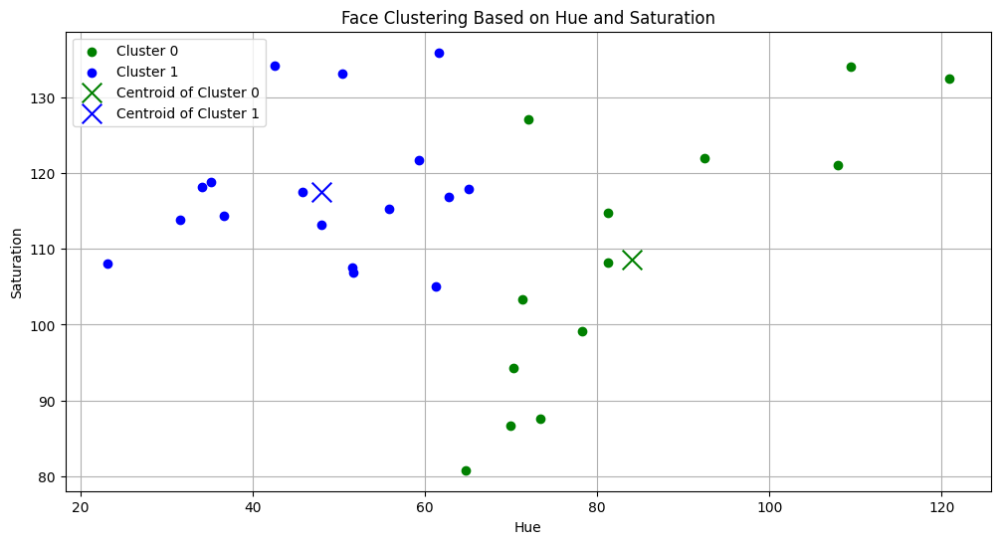
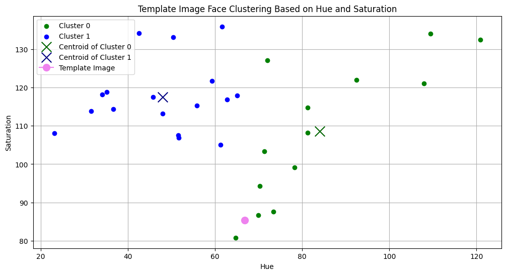

# MLPR-Lab-5

This repository contains the Lab 5 of our course Machine Learning and Pattern Recognition taught at Plaksha University. This lab focuses on distance based feature classification and the various distance metrics used in this process.

The primary objectives of this lab are:
  - Detect faculty faces 
  - Extract color-based features from facial regions
  - Perform clustering using distance metrics
  - Compare Dr Shashi Tharoor's face with the clustered data
  - Understand the uses and applications by answering questions given at the end

Methodology:
  - Image Preprocessing
  - Face Detection
  - Feature Extraction
  - Clustering
  - Distance-Based Classification
  - Visualization

Images Used:
Plaksha Faculty

Dr Shashi Tharoor

Plots:
Plaksha Faculty Plot

Dr Shashi Tharoor + Plaksha Faculty Plot

Scatter Plots:

